<h1 id="installation_(desktop_version)"> Installation (Desktop Version) </h1> 

To get started with Prostgles Desktop, download and install the binary file that's appropriate for your operating system (Windows, macOS, or Linux) from [our website](/download).

- **Linux**: We provide **.deb**, **.rpm** or **.AppImage** files to suit your distribution,
- **macOS**: Open the downloaded **.dmg** file, drag the Prostgles Desktop icon into your Applications folder, and launch the application.
- **Windows** - Run the downloaded **.exe** file and follow the on-screen instructions to complete the installation.

Alternatively, you can visit the [releases page](https://github.com/prostgles/ui/releases) for checksums, release notes or older versions.

## Setting up

When you open Prostgles Desktop, you see the Welcome screen while it loads.
You'll need to complete two initial setup steps:

1. Accept the privacy policy
2. Connect to a state database

#### State database

Prostgles Desktop stores its state and configuration data in a PostgreSQL database.
To maintain a secure and responsive environment, we highly recommend [installing Postgres](https://www.postgresql.org/download/) on your local machine.
You will need to create a dedicated database and superuser account with a strong password for Prostgles Desktop.

