<h3 id="timechart_view"> Timechart view </h3> 

The timechart view allows you to visualize time-series data from your database.
It supports multiple layers, each with its own data source and style.
You can add filters to the timechart to narrow down the data displayed.
<picture>
<source srcset="./screenshots/dark/timechart.svg" media="(prefers-color-scheme: dark)">

</picture>

  - **View header**: Contains menu button, title and window minimise/fullscreen controls.  
    - **View title. Drag to re-arrange layout**: Shows the table/view name together with the number of records matching the current filters.  
    - **Collapse the view**: Collapses the view, minimizing it to temporarily save space on the dashboard.   
    - **Fullscreen**: Expands the view to fill the entire screen.  
    - **Close view**: Closes the view.  
    - **Chart toolbar**: Toolbar for the chart view if not detached. By default, newly charts added will appear over the originating table/sql editor view. They can be detached to a separate window.  
      - **Chart menu**: Menu for the chart view.  
      - **Collapse chart**: Collapses the chart window, minimizing it to save space on the dashboard. It can then be restored by clicking the chart icon in the SQL editor top left quick actions section.  
      - **Detach chart**: Detaches the chart from the parent view, allowing it to be moved and resized independently. It keeps the connection the originating table view to cross filter it.  
      - **Close chart**: Closes the chart view, returning to the originatine table/sql editor view.  
    - <a href="#timechart_view_menu">Timechart view menu</a>: Timechart view menu  
  - **Chart area with controls**: Timechart visualization.  
    - **Layer manager**: Allows adding/removing layers from the chart. Each layer can be configured with its own data source and style.  
      - **Layer list**: Displays the list of layers currently added to the chart.   
        - **Layer color picker**: Allows setting the color for the layer. The color can be set for each column in the layer.  
        - **Table name**: The name of the table used for the layer. This is the table that contains the data for the layer.  
        - **Aggregation function**: Allows setting the y-axis options for the layer.  
          - **Aggregation function**: Selects the aggregation function to be used for the layer. The available options are: Sum, Average, Min, Max, Count.  
          - **Aggregation column**: Selects the numeric column to be used for the aggregation function.   
          - **Group by**: Selects the column to group the data by. This is will create a line for each group by value.  
          - **Close**: Closes the aggregation function popup.  
        - **Toggle layer on/off**: Toggles the visibility of the layer on the chart. This allows you to hide or show the layer without removing it.  
        - **Remove layer**: Removes the layer from the chart. This will delete the layer and its configuration.  
      - **Add layer**: Allows adding a new layer to the chart. The available options are all the tables that have date or timestamp columns.  
    - **Reset extent**: Resets the chart to the default extent, showing all data points. Visible when the chart was paned or zoomed.  
    - **Layer legend**: Displays the layers currently added to the chart. Quick access to changing the layer color, aggregation type and group by.  
    - **Add/Edit time filter**: Allows adding a time filter to the timechart. This will filter the data points based on the selected time range.  
    - **Timechart canvas**: Zoomable and pannable canvas that displays the timechart. It shows the data points based on the selected layers and filters. Clicking on a point will add a filter with that time bucket.  

<h4 id="timechart_view_menu"> Timechart view menu </h4> 

The timechart view menu provides options for configuring the timechart.

